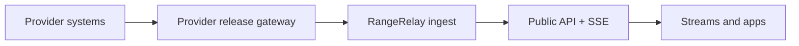

# RangeRelay

**A provider-controlled release gateway and neutral public API for launch telemetry.**

RangeRelay lets launch providers publish a deliberately small, public-safe telemetry feed once, while streamers, educators, newsrooms, mission-control displays, accessibility tools, and other apps consume one stable API.

The name is a working product name. “Range” anchors it in launch operations; “Relay” describes the one-way distribution role. Complete trademark and domain clearance before incorporation or a public brand launch.

## The product, in one sentence

RangeRelay is not a pipe from a rocket. It is the last, controlled hop from a provider-owned release gateway to the public internet.



The release gateway runs inside the provider boundary and constructs a new public payload from an explicit field allowlist. Unknown fields fail closed. Providers can reduce precision, derive values, delay publication, stop a channel instantly, and test the exact public output before flight. There is no command path back to the provider or vehicle.

## What is implemented

This repository now contains both the public product experience and the zero-dependency TypeScript API reference:

- responsive Next.js 16 marketing site;
- provenance-aware public mission explorer;
- provider release control room with dry-run, manifest, authorization, stop, credential, and audit UX;
- consumer developer workspace with channel discovery, live event inspection, API key prototype, and copyable examples;
- metadata, sitemap, robots policy, accessible reduced-motion support, and production standalone build;

- signed HMAC-SHA256 ingestion with a 30-second replay window;
- immutable deny rules plus per-channel field allowlists, types, units, bounds, and string limits;
- `off`, `armed`, and `live` publication states;
- configurable publication delay, rate limit, deduplication, and retention;
- public channel discovery, latest snapshot, historical events, and Server-Sent Events;
- an emergency administrative stop endpoint;
- a provider-side projection example proving internal fields are never serialized;
- OpenAPI 3.1 documentation and automated policy, signature, and end-to-end tests.

The in-memory event store is intentional for this reference slice. The production plan replaces it with a durable log and object storage without changing the public contract.

## Run it

Node.js 24 or newer is required.

```bash
cp .env.example .env
npm install
npm test
npm run dev
```

The product UI runs at `http://localhost:3000`. The reference ingestion API remains independently runnable:

```bash
npm run dev:api
node --experimental-strip-types examples/provider-gateway/gateway.ts
curl http://127.0.0.1:8787/v1/channels/demo-flight/latest
curl -N http://127.0.0.1:8787/v1/channels/demo-flight/stream
```

The current UI uses labeled synthetic pilot data. Set `NEXT_PUBLIC_SITE_URL` and `NEXT_PUBLIC_RANGERELAY_API_URL` in the deployment environment before connecting live product data.

## API surface

| Method | Path | Purpose |
| --- | --- | --- |
| `GET` | `/health` | Service health |
| `GET` | `/v1/channels` | Discover public channels and schemas |
| `GET` | `/v1/channels/{id}` | Read one channel definition |
| `GET` | `/v1/channels/{id}/latest` | Read the latest released event |
| `GET` | `/v1/channels/{id}/events` | Catch up by sequence number |
| `GET` | `/v1/channels/{id}/stream` | Consume live events over SSE |
| `POST` | `/v1/ingest/{id}` | Provider ingestion; signed, never public-authenticated |
| `POST` | `/v1/admin/channels/{id}/status` | Emergency stop/state control |

See [`openapi.yaml`](openapi.yaml) for the full contract.

## Non-negotiable boundaries

- Public-release telemetry only. RangeRelay is not an export-controlled-data enclave.
- No commands, command metadata, flight-termination data, security keys, raw packets, or unrestricted engineering telemetry.
- No inbound network path from RangeRelay into provider systems.
- A stop prevents future publication; it cannot recall data already received or cached by consumers.
- “Provider-certified” is cryptographically and contractually distinct from “community-derived.”
- Provider counsel and empowered mission officials approve every production schema and release policy.

## Repository map

| Path | Contents |
| --- | --- |
| `app/` | Marketing, provider, consumer, explorer routes and metadata |
| `components/` | Shared product UI and interactive workspaces |
| `data/` | Synthetic, clearly labeled pilot fixtures |
| `src/` | Reference API, policy engine, signing, and event store |
| `examples/provider-gateway/` | Provider-side safe projection and publisher |
| `config/channels.json` | Demo public schema and release policy |
| `test/` | Security, policy, and end-to-end tests |
| `docs/PRODUCT_PLAN.md` | Product strategy, operating model, roadmap, and economics |
| `docs/TRUST_AND_SAFETY.md` | Data classification, provider controls, threat model, and incidents |
| `docs/LEGAL_READINESS.md` | US-first legal issue checklist and required agreements |
| `docs/PROVIDER_ONBOARDING.md` | Pilot-to-flight provider workflow |
| `docs/ARCHITECTURE.md` | Production architecture and technical decisions |

## Current status

This is a validated product prototype and reference API, not a production launch service. Provider/consumer authentication and control-plane mutations are intentionally represented as synthetic pilot interactions until durable persistence, identity, authorization, managed keys, and audit services are implemented. Before any real provider data is accepted, complete the P0 gates in the product plan: counsel review, two-person production authorization, durable append-only audit records, managed key custody, tenant isolation, load/chaos tests, an incident exercise, and a provider-signed schema authorization.

## License

Apache-2.0. A permissive, inspectable provider gateway is part of the trust strategy.
