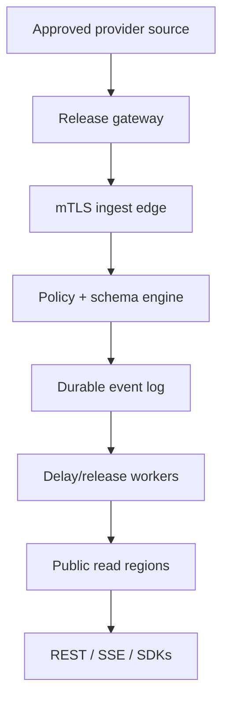

# Production architecture

## Design principles

1. Ingest is not connected to commands or provider control systems.
2. Projection happens before the provider trust boundary is crossed.
3. The provider-side schema and platform schema must have the same signed hash.
4. Ingest availability and public-read load are isolated.
5. Accepted events are durable before acknowledgment.
6. Every consumer can distinguish observation, receipt, and release times.
7. Provenance is cryptographically verifiable and impossible to omit from the canonical event.



## Planes

| Plane | Responsibilities | Must not do |
| --- | --- | --- |
| Provider gateway | Read minimal source, project, quantize, validate, sign, spool/retry, local audit | Accept remote commands or forward arbitrary objects |
| Ingest | Authenticate provider, enforce window/rate/idempotency, verify manifest hash, durably append | Serve public fanout or transform semantics |
| Control | Tenant, RBAC, approvals, schemas, keys, mission windows, stop, audit | Carry flight telemetry payloads in ordinary logs |
| Release | Enforce delay/embargo, attach provenance signature, publish/correct | Release early after failover or clock error |
| Public read | Discovery, snapshots, replay, SSE/WebSocket, quotas, SDK contract | Share provider credentials or internal rejection detail |

## Canonical event

The reference MVP implements the minimum envelope:

```json
{
  "eventId": "flight-00001234",
  "channelId": "provider-mission",
  "schemaVersion": "1.0.0",
  "observedAt": "2026-09-15T12:00:00.000Z",
  "receivedAt": "2026-09-15T12:00:00.120Z",
  "releaseAt": "2026-09-15T12:00:30.120Z",
  "sequence": 1234,
  "values": { "altitude": 42100, "speed": 1750 }
}
```

Production adds `provenance`, `manifestHash`, `producerSignature`, `relaySignature`, `quality`, and correction/tombstone linkage. Field definitions include UCUM-compatible units where practical. The public contract is intentionally simpler than XTCE. Add an XTCE 1.2 import/export bridge for metadata interoperability; do not expose command metadata through the public service.

## Delivery semantics

- At-least-once ingest with `(channelId, eventId)` idempotency.
- Monotonic provider `sequence`; gaps are preserved and signaled, not renumbered.
- Acknowledgment only after durable append in the write region/quorum.
- Release workers use `releaseAt`, not arrival order.
- Consumers reconnect with SSE `Last-Event-ID` or REST `after` sequence.
- Corrections are new signed events referencing the original; history is not silently rewritten.
- Channel `off` stops new releases and emits a signed status event. It cannot retract delivered public events.

## Suggested production components

Stay vendor-neutral at the contract layer. A practical deployment can use:

- managed PostgreSQL for control-plane entities and approval workflow;
- a durable ordered stream (Kafka-compatible, cloud pub/sub, or equivalent) for accepted events;
- object storage with retention lock for audit/archive;
- CDN/edge cache for discovery and snapshots;
- regional fanout workers for SSE/WebSocket;
- KMS/HSM-backed asymmetric keys and mTLS identities;
- OpenTelemetry for service observability, kept separate from flight telemetry terminology/data.

The reference server uses memory and HMAC so it runs without infrastructure. It is not the production persistence or key model.

## Control-plane data model

| Entity | Key fields |
| --- | --- |
| Provider | identity, verified domains, status, contacts, agreement version |
| Mission | provider, public identity, start/end, automatic stop, provenance |
| Channel | mission, status, rate, delay, retention, read policy |
| SchemaManifest | canonical JSON, SHA-256, semantic version, approval expiry |
| FieldDefinition | name, type, unit, bounds, precision, derivation, classification reference |
| Approval | manifest hash, actor, role, decision, timestamp, signature |
| Credential | provider/channel/environment, public key/cert, validity, revocation |
| AuditEvent | actor/system, action, target, request ID, time, previous hash |
| TelemetryEvent | channel, event ID, sequence, three timestamps, manifest hash, values, signatures |
| Correction | original event, reason, replacement/tombstone, authority |

## API/versioning policy

- `/v1` changes remain backward compatible.
- Adding an optional field is non-breaking; changing meaning, units, type, requiredness, or precision contract requires a new schema major version.
- Channel schema is immutable while `armed` or `live`.
- Consumers must ignore unknown envelope fields but must not guess unknown value semantics.
- Deprecations include machine-readable sunset dates and at least one complete mission cycle of overlap.

## Scalability target for first provider pilot

Assume 20 telemetry events/second, 10 KiB maximum event, 100,000 concurrent viewers, and a 6-hour mission window. The public read plane fans out once per region rather than querying the event store per viewer. Rehearsal load should exceed expected event rate 5× and viewers 2×, including reconnect storms and one-region failure.

## Reference MVP gaps

- in-memory, single-process storage and rate state;
- symmetric shared signing key;
- one global ingest key and admin token;
- no tenant database or identity provider;
- no persisted audit chain, correction model, or field-level provenance;
- no manifest hashing/dual approval implementation;
- no automatic mission expiry or multi-region release clock validation;
- SSE only, no production fanout service.

These are explicit gates, not hidden technical debt. Do not connect this slice to real provider systems.
